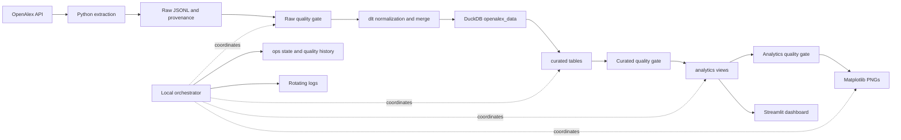

# AI Research Trend & Paper Intelligence Pipeline

A B.Tech Data Engineering project for collecting OpenAlex scholarly metadata and exploring the papers, topics, authors, and institutions in a local research dataset. It preserves replayable raw JSONL, normalizes it with dlt into DuckDB, builds relational entities and SQL analytics, and serves static charts and a read-only Streamlit dashboard. File-level incremental processing, quality gates, run history, and logs support repeatable local operation.

## Architecture



Extraction is a separate command; the orchestrator starts with completed local files. The dashboard is launched independently after warehouse processing. It does not execute the gates or rebuild data on page loads.

| Layer | Location / ownership |
| --- | --- |
| Raw | `data/raw/openalex/`: extraction-owned JSONL and matching `.metadata.json` completion markers |
| Ingestion | `openalex_data`: dlt-owned `works`, normalized child tables and internal tracking tables; dlt also manages `openalex_data_staging` |
| Curated | `curated`: seven project-owned SQL tables with explicit entity and relationship grains |
| Analytics | `analytics`: SQL views over curated data, shared by charts and dashboard |
| Operations | `ops`: pipeline runs, processed-file fingerprints, pending state and quality history |

See [architecture and recovery](docs/architecture.md), [data model and metric definitions](docs/data_model.md), and the [5–8 minute demo](docs/demo.md).

## Coverage and methodology

**Counts describe the loaded dataset, not worldwide research totals.** OpenAlex is the source; extraction filters by keyword and publication year and is bounded by `--max-records`. A bounded selection is not a statistically representative sample. Equal per-year caps are extraction limits, not global publication volumes. Temporal claims require complete or otherwise appropriate, comparable coverage; one year cannot demonstrate growth.

Each new provenance sidecar records the query, timestamps, requested cap, extracted count and first-page `source_match_count` when known. `is_complete_extraction` is true only when that known count is reached. It describes that query at extraction time, not the worldwide corpus or a consistent source snapshot. Unknown counts are not declared complete; older sidecars without these fields remain supported.

Missing metadata stays unknown. Quality reporting measures DOI, title, primary-topic, author, institution and known open-access coverage. Citation averages exclude null counts. Confirmed-open-access shares include unknown flags in the denominator; unknown status is never treated as closed. Author, institution and topic totals use full counting and are not additive corpus totals.

## Setup (Windows PowerShell)

Use Python 3.11 or newer; validation has used **Python 3.13.4 on Windows**. Other interpreter versions have not been verified. Git and internet access are needed for cloning, dependency installation and live extraction. Run commands from the repository root.

```powershell
git clone https://github.com/deeps2710/AI-Research-Trend-Pipeline.git
cd AI-Research-Trend-Pipeline
python -m venv .venv
.\.venv\Scripts\Activate.ps1
python -m pip install -r requirements.txt
Copy-Item .env.example .env
```

Copy the template only on first setup. Edit `.env` and set `OPENALEX_API_KEY` to your own key. Existing environment variables take precedence. `.env` is ignored and must not be committed. A blank/example value sends no key; access then depends on OpenAlex's current anonymous limits. No credentials are needed to process existing local files.

If activation is restricted, use `.\.venv\Scripts\python.exe` in place of `python`, and `python -m streamlit` in place of `streamlit`. No package installation beyond the requirements file is required when running from the repository root. Runtime dependencies are not pinned, so a fresh install is not a locked environment.

## Quick start

This live request saves at most five papers. Skip extraction if completed local raw files are already available.

```powershell
python -m scripts.extract_openalex --keyword machine-learning --year 2025 --max-records 5 --per-page 5
python -m scripts.run_pipeline
python -m scripts.check_data_quality
python -m scripts.pipeline_status
streamlit run dashboard/app.py
```

The runner processes **all new or changed completed files** in its raw directory, not just the latest extraction. On an empty clone, charts and some dashboard sections may have insufficient data. WARN results can be expected for sparse metadata or a single year; FAIL results require correction before proceeding.

Stop the dashboard and other warehouse users before running write commands, including the quality checker (which persists ops history). Then relaunch the dashboard. DuckDB is a local file database; the orchestrator lock does not coordinate independently launched stage CLIs.

Defaults are anchored to the repository in `src/config.py`: raw files in `data/raw/openalex`, warehouse at `data/warehouse/research_trends.duckdb`, charts in `outputs/figures`, logs in `logs`. Explicit relative path overrides resolve from the caller's working directory. The dashboard accepts `RESEARCH_WAREHOUSE_PATH` as an environment override. Avoid database filenames `curated.duckdb` and `analytics.duckdb`, which conflict with schema names.

## Commands

Every database CLI accepts `--db-path PATH` and its compatible alias `--database PATH`. All module commands support `--help`. Individual stages are useful for inspection or debugging; the orchestrator supplies the full ordered workflow and persisted gates.

| Command (prefix with `python -m scripts.`) | Purpose / additional options |
| --- | --- |
| `explore_openalex` | Live machine-learning/2025 preview, up to 10 papers; saves nothing |
| `extract_openalex` | Bounded extraction: `--keyword`, `--year`, `--max-records`, `--per-page`, `--output-dir` |
| `load_openalex` | dlt merge of `--input-file PATH`; defaults to newest completed raw file by modification time |
| `inspect_warehouse` | Discover ingestion tables, counts and small samples |
| `build_curated` / `inspect_curated` | Rebuild / inspect the seven relational tables |
| `build_analytics` / `inspect_analytics` | Rebuild / inspect analytical views |
| `generate_visualizations` | PNG export; `--output-dir`, `--top-n` (1–30, default 10) |
| `run_pipeline` | `--raw-directory`, `--output-dir`, `--force`, `--rebuild-downstream`, `--skip-visualizations` |
| `check_data_quality` | Check curated/analytics data and persist results; nonzero exit on FAIL |
| `pipeline_status` | Read health, history and pending work; `--raw-directory` |
| `benchmark_pipeline` | Time builds/checks/queries on a temporary database copy; optional `--explain` |

Extraction defaults: keyword `machine-learning`, year `2025`, maximum 250 records and page size 100. Keywords are lowercase hyphenated slugs; page sizes are 1–100. An explicitly chosen loader input must be a Works JSONL file; unlike automatic discovery, it need not have a sidecar.

Examples for local rebuilds and inspection:

```powershell
python -m scripts.run_pipeline --rebuild-downstream --skip-visualizations
python -m scripts.inspect_warehouse
python -m scripts.inspect_curated
python -m scripts.inspect_analytics
python -m scripts.generate_visualizations --db-path data/warehouse/research_trends.duckdb --output-dir outputs/figures --top-n 10
```

## Curated model and analytics

OpenAlex IDs are business keys. dlt's `_dlt_id` / `_dlt_parent_id` connect normalized ingestion records and are excluded from curated outputs.

| Table in `curated` | Grain / logical key |
| --- | --- |
| `papers` | One Work / `paper_id` |
| `topics` | One identified topic / `topic_id` |
| `paper_topics` | One distinct `(paper_id, topic_id)` relationship |
| `authors` | One identified author / `author_id` |
| `paper_authors` | One distinct `(paper_id, author_id)` relationship |
| `institutions` | One identified institution / `institution_id` |
| `paper_institutions` | One distinct `(paper_id, institution_id)` relationship |

Separate many-to-many bridges prevent a paper's authors, topics and institutions from multiplying one another. Relationship summaries use `COUNT(DISTINCT paper_id)` and deduplicated pairs; citations are summed within one relationship domain at a time. See the [ER diagram and optional attributes](docs/data_model.md).

| View in `analytics` | Provides |
| --- | --- |
| `overview_kpis` | One row: papers, citations, mean/median, confirmed OA count/share, unique entities and year range |
| `publication_trends` | Observed year totals and consecutive-year growth |
| `topic_summary` | Distinct papers, citation measures and OA share per linked topic |
| `topic_yearly_trends` | Topic/year volumes, citations and consecutive-year growth |
| `top_papers` | Every paper, deterministic citation rank and available descriptive/age-adjusted fields |
| `author_summary` | Distinct authored papers, full-count citations and OA measures |
| `institution_summary` | Distinct affiliated papers and full-count citation measures |
| `open_access_summary` | Paper counts and shares by status, including unknown |

Optional source columns determine available metrics; absent year or OA-status columns omit their dependent views. Year-over-year growth is `100 * (current - previous) / previous`, only for consecutive observed calendar years with a nonzero denominator. Missing years are not filled with zero.

The project-derived citation-age heuristic divides citations by `max(1, current_year - publication_year + 1)` at query time; null/future years yield null. It is not a field-normalized impact measure and does not remove citation-age bias. Full-count attribution gives each linked author/institution the paper's full citations, irrespective of contributor count.

## Incremental processing and operations

The orchestrator compares normalized file paths and SHA-256 hashes against `ops.processed_files`. Unchanged files are skipped; changed/new files are validated and merged by Work ID. An unchanged run with no pending work skips downstream builds too. `--force` reprocesses discovered files using merge; `--rebuild-downstream` refreshes derived layers without requiring raw changes. `--skip-visualizations` leaves charts pending for the next enabled run.

Ordering is raw quality → dlt → curated → curated quality → analytics → analytics quality → optional charts. Failures stop dependent work; durable pending flags support retries. Runs, safe error summaries and submitted record counts are retained in `ops`. This is file-level incremental ingestion. API CDC, source deletion handling and source-update ordering are not implemented. OpenAlex's updated/created-date synchronization filters require eligible paid access; see [OpenAlex sync-filter documentation](https://help.openalex.org/api/filtering/).

| Quality status | Meaning |
| --- | --- |
| PASS | The stated check condition holds |
| WARN | Optional metadata is sparse or temporal coverage is insufficient; processing continues |
| FAIL | Invalid raw/schema/identity/references/metrics; CLI exits nonzero and gates block dependent stages |

Checks cover nonblank unique keys, finite nonnegative citations, valid years, bridge integrity, raw/provenance count agreement and analytical KPI reconciliation. Coverage warnings are informational, not a claim of representative sampling. The standalone checker evaluates the warehouse; raw checks run when the orchestrator selects files for ingestion.

`pipeline_status` reports recent runs, duration, last success and its age, pending files/builds, latest quality scope, paper volumes and represented years. A recent no-op success is **not evidence of fresh OpenAlex extraction**; no freshness SLA is imposed. `logs/pipeline.log` rotates at 2 MB with three backups and records stages, counts, hashes and timings. Logs are ignored; normal failure handling uses safe summaries and credential redaction. See [state and recovery details](docs/architecture.md).

## Dashboard and visualizations

Launch with `streamlit run dashboard/app.py`. The dashboard reads analytical views using short-lived read-only connections, bounded queries, parameterized filters and a 30-second data cache. It uses `curated.paper_topics` only for topic-membership filtering without row fan-out.

| Page | Exploration |
| --- | --- |
| Overview | KPIs, publications, top topics and OA distribution |
| Research Trends | Yearly counts, available growth and up to five topic series |
| Topic Intelligence | Selected-topic metrics, history and its top 20 cited papers |
| Paper Explorer | Year, associated topic, minimum citations, OA status, citation/year/title sorting and 10–200 rows |
| Authors & Institutions | Rankings and tables with top-5 to top-30 controls |

Coverage warnings stay visible. Missing data and one-year samples produce explanatory messages. Filters are page-local; they do not redefine global KPIs.

Matplotlib exports nine possible PNG types: publication counts, YoY growth, top topics, topic time series, citation distribution, top cited papers, OA distribution, top authors and top institutions. Unsupported charts are skipped; stale batch files for those charts are removed. The citation histogram uses log-spaced `log(1 + citations)` bins with original-unit labels, retaining zero counts and showing mean/median. Ranked charts default to top 10; topic series are capped at five.

Generated figures live in ignored `outputs/figures/`; the dashboard renders figures in memory. No sample screenshots are versioned. To add presentation images later, manually choose a reviewed screenshot, label its extraction date and bounded coverage, and place it in a dedicated documentation assets directory. Do not commit the generated output directory.

## Technology and repository layout

| Technology | Role |
| --- | --- |
| Python, requests, python-dotenv | Pipeline/application code, HTTP extraction and local environment configuration |
| OpenAlex | Scholarly metadata source |
| dlt with DuckDB destination | Inference, nested normalization, loading and Work-ID merge semantics |
| DuckDB and SQL | Embedded warehouse, transactional curated builds and analytical views |
| Pandas | Small analytical results passed to presentation code |
| Matplotlib / Streamlit | Static chart export / interactive exploration |
| unittest / Ruff | Offline automated validation / development correctness linting |

```text
README.md                 # Setup, usage, methodology and project overview
docs/                     # Architecture, data model and demo guide
src/                      # Extraction, load, transforms, quality, orchestration,
                          # visualization, shared config/logging and benchmark
scripts/                  # Command-line entry points
dashboard/              # Streamlit app, data access, components and views
sql/curated/              # Seven entity/bridge transformations
sql/analytics/            # Eight analytical view definitions
tests/                    # Offline unittest fixtures and integration checks
.env.example              # Credential placeholder; local .env is ignored
requirements.txt          # Runtime dependencies
requirements-dev.txt      # Runtime dependencies plus Ruff
pyproject.toml            # Ruff configuration
data/raw/openalex/        # Generated/ignored JSONL and provenance
data/warehouse/           # Generated/ignored DuckDB and dlt working state
outputs/                  # Generated/ignored figures and local diagnostics
logs/                     # Generated/ignored rotating application logs
```

## Design decisions and limitations

OpenAlex provides linked scholarly entities. JSONL keeps selected source records replayable and streamable; dlt owns nested normalization and merge behavior. DuckDB supports a local analytical workflow without a database service. SQL makes grains and measures reviewable; bridges preserve many-to-many relationships. Merge avoids duplicate Works on replay, separate analytics views centralize metrics, and a separate dashboard keeps refreshes explicit. File hashes detect local changes without requiring premium source synchronization.

Source metadata and topic classifications determine analytical coverage. Older papers have had longer to receive citations; full-count entity rankings overlap. Replaying older files can overwrite newer metadata, and omitted papers do not imply deletion. Runtime dependencies are not locked. This local application has no distributed execution, automatic scheduler, cloud deployment, ML, embeddings, semantic search, RAG or recommendation engine.

## Development and validation

```powershell
python -m pip install -r requirements-dev.txt
python -m unittest discover -s tests -v
python -m ruff check src scripts dashboard tests
python -m compileall -q src scripts dashboard tests
python -m pip check
python -m scripts.benchmark_pipeline
python -m scripts.benchmark_pipeline --db-path data/warehouse/research_trends.duckdb --explain
```

The suite uses mocked HTTP and temporary real DuckDB/dlt fixtures, including replay, merge, rollback, failure recovery, quality gates, metric semantics, plotting and all dashboard pages. It does not call OpenAlex. Ruff enables `F` and `E9`; there is no pytest dependency or CI workflow.

The benchmark requires an existing ingestion warehouse. It copies the database and any WAL under a read lock, runs builds/checks on the temporary copy, and reports median timings from three warm query executions after a warm-up. `--explain` emits DuckDB execution plans. Close source writers first. These measurements are local diagnostics, not evidence of production scale.
