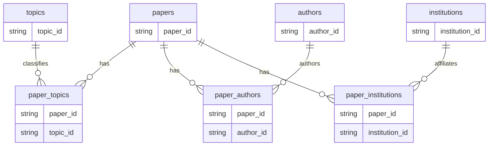

# Data model and metric semantics

[Back to README](../README.md)

## Logical curated relationships

This diagram shows business keys and relationships validated by project quality checks. It does **not** assert declared DuckDB primary/foreign-key constraints: curated tables are built with `CREATE OR REPLACE TABLE AS SELECT`.

Entities have one row per named ID; bridges have one row per pair of endpoint IDs. A paper may have no identified topic, author or institution. Missing entity IDs are omitted without inventing identifiers or dropping the identified paper.

## From ingestion lineage to business identity

`openalex_data.works` supplies paper IDs. Topic and authorship children join `_dlt_parent_id` to the Work's `_dlt_id`; institution children join through the parent authorship. These technical keys preserve ingestion lineage and are excluded from curated outputs. An identified institution can survive an unknown author because institution lineage does not depend on an author business ID.

| Curated table | Attributes included when source columns exist |
| --- | --- |
| `papers` | DOI, title, publication year/date, work type, citations, OA flag/status, primary topic ID/name, primary source ID/name |
| `topics` | Topic name and subfield/field/domain IDs and names |
| `paper_topics` | Maximum relationship score and primary-topic flag when supported |
| `authors` | Author name |
| `paper_authors` | Author position and corresponding-author flag |
| `institutions` | Institution name, country code and type |
| `paper_institutions` | Distinct paper/institution pairs; shared affiliation across authors is counted once |

Optional null values stay null. Missing columns are omitted. Absent nested tables produce empty key-only curated dimensions/bridges. There are no separate curated keyword or source dimensions. Labels use deterministic representatives from source rows, not guaranteed latest labels; duplicate author pairs retain attributes from the lowest technical authorship ID.

## Avoiding fan-out

A paper with two authors and three topics yields six rows if both bridges are joined together. Summing its citations over that product would count them six times. Each analytical domain instead joins one deduplicated bridge to `papers`. `COUNT(DISTINCT paper_id)` protects the intended relationship count; it does not by itself repair citation sums over an arbitrary cross-domain join.

Topic, author and institution measures use full counting: each linked entity receives the full paper and its citations. Two authors sharing a 10-citation paper each receive 10 citations in `author_summary`, while the overview counts 10 once. Summing author or institution totals is therefore not a unique corpus total. Institution deduplication prevents multiple affiliated authors from counting the same paper twice within one institution.

## Analytical contracts

The [README view inventory](../README.md#curated-model-and-analytics) lists all eight definitions. `overview_kpis` aggregates directly at paper grain; relationship summaries include linked entities. Unique entity counts come from curated dimensions. Consumers must apply explicit ordering and limits: `top_papers` contains every paper, not a permanent top-N subset.

- **Years:** yearly views exclude unknown years and reconcile to papers with known years. Growth uses the immediately preceding calendar year, not simply the previous available row. First observations, gaps and zero denominators yield null growth. Topic growth is partitioned by topic.
- **Citations:** sums, means and medians use known values; all-null groups remain null. Citation rank uses descending citations, nulls last, and ascending paper ID to resolve ties.
- **Citation age:** `citation_reference_year` is the database-session calendar year at query time. `citations_per_year_since_publication = cited_by_count / max(1, reference_year - publication_year + 1)` for known nonfuture years. This inclusive calendar-year heuristic does not account for precise publication date, field differences or source citation-update lag.
- **Open access:** confirmed OA share divides true OA flags by all papers in the group, including unknown flags. Missing/blank status is grouped as `unknown`. Unknown is not closed; a false/closed value still counts as known metadata for quality coverage.
- **Optional schemas:** publication/yearly-topic views require publication year; OA summary requires status. Other missing fields omit only dependent metrics. Rebuild analytics after curated schema changes to remove unsupported definitions.

Bounded extraction and unequal source coverage limit interpretation regardless of SQL correctness. Consult the visible [coverage methodology](../README.md#coverage-and-methodology) before presenting counts or growth.
